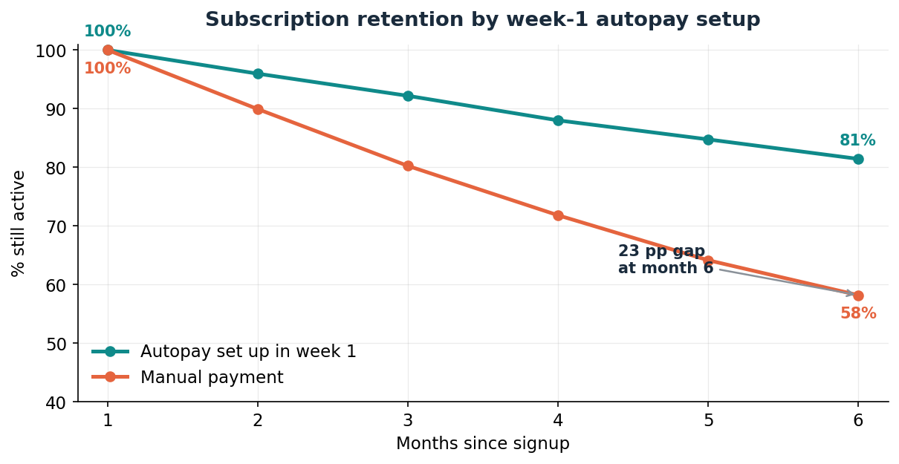

# Retention-Analysis# 
Why are we losing subscribers? Most of them never chose to leave.

**A retention analysis of a subscription hardware business — Raquel Rodericks**

*Note: built on a synthetic dataset modelled on a subscription water-purifier business, for portfolio purposes. Method and reasoning are what matter here, not the specific figures.*

---

## The question

Six-month retention sits at **64%**. Leadership wants it higher and the instinct in the room is a loyalty problem — better product, better perks, more reasons to stay. Before spending on any of that, I wanted to know *who* is leaving and *why*, because the fix is completely different depending on the answer.

## What the data shows

Splitting the base by a single onboarding behaviour — whether a user set up **autopay in their first week** — produces a large and stable gap:

| Segment | 6-month retention |
|---|---|
| Set up autopay in week 1 | **78%** |
| Manual payment | **53%** |
| Overall | 64% |

A 26-point gap. The easy conclusion is "autopay users are simply more committed — so push everyone to autopay." That conclusion is where the analysis *starts*, not where it ends, because it doesn't explain the mechanism. So I split the churn itself by reason.

## The actual finding

Among manual-pay users who churned, **54% left through a failed or missed payment — not a decision to cancel.** That is a quarter of the entire manual-pay base silently dropping out because a payment didn't go through.

These customers did not evaluate the product and choose to leave. They were *lost* — the subscription ended on their behalf. That reframes the whole problem:

- **Voluntary churn** (dissatisfaction, moving, cost) is a product and value problem.
- **Involuntary churn** (payment failure) is a plumbing problem — and it's the larger share of the gap.

Treating retention as one number hid this completely. The 64% headline says "loyalty"; the split says "billing".

## Recommendation

1. **Make autopay the default path in onboarding** — opt-out, not opt-in — with manual payment still available for users who choose it. This attacks the mechanism directly, not just the correlation.
2. **Build a failed-payment recovery flow** — retry logic, and a clear reminder-and-reactivation nudge before a lapse becomes a cancellation. Every recovered payment here is a customer who never wanted to leave.
3. **Report voluntary and involuntary churn separately from now on.** They have different owners (Product vs. Payments) and different fixes; a blended number will keep hiding this.

## How to tell it's working

Track the **involuntary-churn rate** as its own metric, not folded into total churn. If the autopay default and recovery flow work, that line should fall while voluntary churn stays roughly flat — which would confirm the gain came from fixing billing friction, not from a temporary bump. Run the onboarding default change as an **A/B test** (autopay-default vs. current opt-in) so the retention lift is attributable rather than assumed.

---

*Analysis in Python (pandas); dataset and code included alongside this document. ~6,000 users, six monthly cohorts.*
